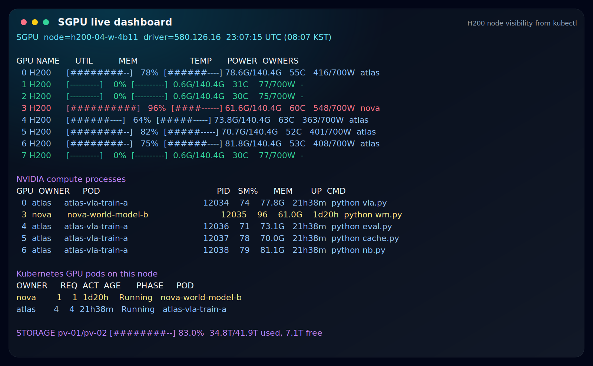
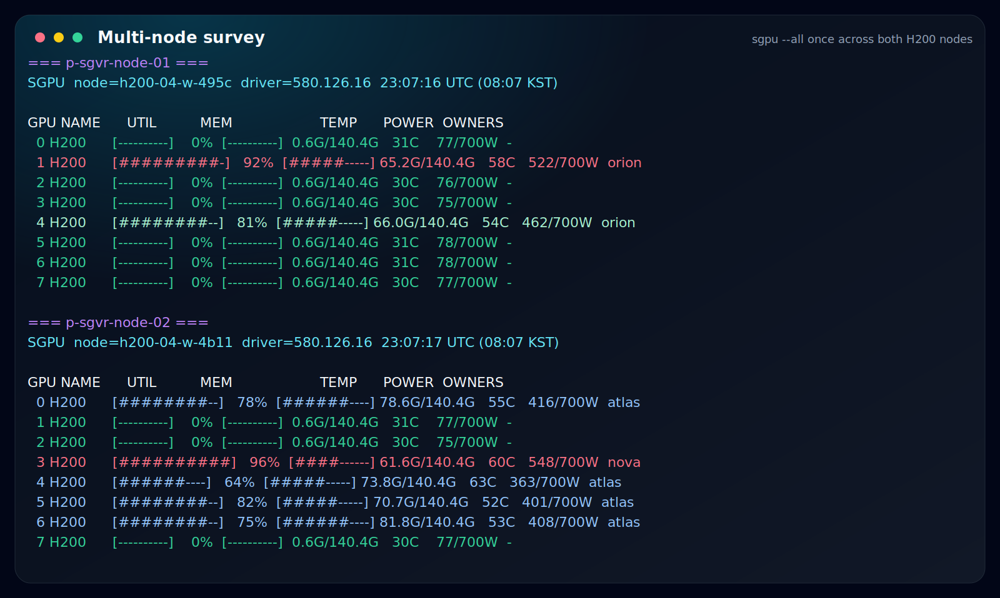
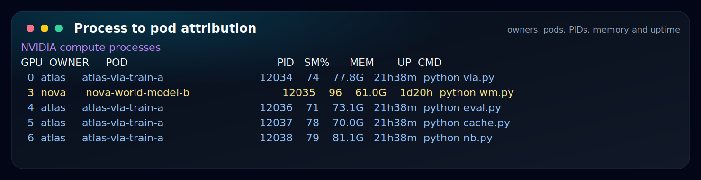
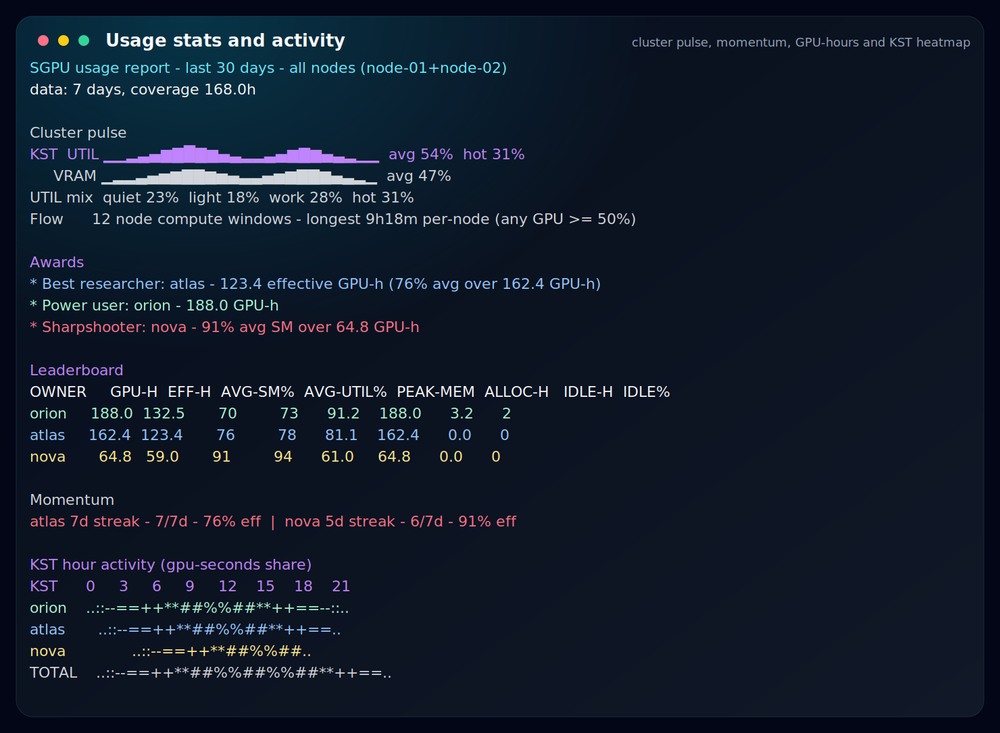

# SGPU

**SGVR GPU** / **Simple GPU** monitor for the lab's MLXP H200 nodes.
Check GPU ownership, utilization, storage, and usage history before launching
another Kubernetes pod.

<p align="center">
  
</p>

- Every GPU process is attributed to its **pod and owner**, not just a PID.
- One client can survey **both H200 nodes** with `sgpu --all once`, or pick a
  node with `sgpu -n 1` / `sgpu -n 2`.
- **In-pod TUI** via `kubectl exec -it`: smooth refresh, scrolling, sorting,
  owner filtering, and a stats screen.
- **Usage stats 24/7**: per-owner GPU-hours, awards, KST activity heatmaps,
  and idle-allocation warnings.
- Shared **storage (pv-01/pv-02) usage** at a glance.
- Monitor pod is read-only, always-on, and requests **no GPU**.

## Install

```bash
uvx sgpu            # run without installing (uv)
pipx install sgpu   # or pipx
pip install sgpu    # or plain pip (WSL/Ubuntu: add --user --break-system-packages)
```

Needs `kubectl` with an MLXP kubeconfig ([setup](#kubectl-setup-linuxwsl)).
One kubeconfig covers **both** H200 servers - the two downloads
(`sgvr-node-01`/`-02`) share the same token and contexts, so either file
works for every node.

## Use

```text
sgpu               interactive TUI      sgpu stats [days]  usage report + awards
sgpu once          one-shot dashboard   sgpu apps          processes + owners
sgpu watch [sec]   dumb-terminal loop   sgpu nvitop        raw nvitop
sgpu pods|smi|gpustat|json|health|version|--help
```

### Pick a node

MLXP has two H200 servers (`p-sgvr-node-01`, `p-sgvr-node-02`):

```text
sgpu -n 1 once        node-01   (shorthand for p-sgvr-node-01)
sgpu -n 2 once        node-02
sgpu --all once       survey both nodes at once (any text command)
sgpu once             uses your current kubectl context's namespace
```

TUI keys:

```text
j/k       scroll
Tab       switch pane
s         sort
o         owner filter
p         pause
t         stats screen
h/d/w/m   stats axis: hour/day/week/month
a         cycle stats axis
r         refresh
q         quit
```

Options: `-n` namespace, `--pod`, `-r` refresh, `--no-color`.
Env: `SGPU_NAMESPACE`, `SGPU_POD`.

## Screenshots

### Multi-node Survey

<p align="center">
  
</p>

### Process Attribution

<p align="center">
  
</p>

### Usage Stats

<p align="center">
  
</p>

## Zero Install

Anyone with `kubectl` access can use the monitor pod without installing
`sgpu`.

```bash
kubectl exec -it -n p-sgvr-node-01 sangmin-gpu-monitor -- python3 /opt/gpu-monitor/tui.py
kubectl exec -n p-sgvr-node-01 sangmin-gpu-monitor -- curl -fsS http://127.0.0.1:8080/table
```

Endpoints on `:8080`:

```text
/table /apps /json /stats /pods /smi /topo /gpustat /health /version
/stats/files /stats/raw?date=YYYYMMDD
```

Text endpoints support `?color=1&cols=N&ascii=1`.

## Stats

SGPU samples every 15 seconds around the clock into raw JSONL, gzips and rolls
up daily summaries, and stores the results on the shared volume at
`pv-01/sangmin/sgpu`.

Retention defaults to 365 days and is capped at 2 GB. `sgpu stats 30` shows
leaderboards, awards, daily activity, and KST hour heatmaps.

> The monitor pod must stay running for stats to accumulate. It is designed to
> do that with tini init, `restartPolicy: Always`, and no GPU allocation.

## What the numbers mean

Press `?` in the TUI for this same reference in-app.

| Column | Meaning |
| --- | --- |
| `UTIL` | Whole-GPU utilization %: share of time the GPU did **any** work (NVML/nvidia-smi). |
| `SM%` | Per-**process** SM (streaming-multiprocessor) activity — how hard that process drove the GPU cores. |
| `MEM` / `PEAK-MEM` | GPU memory in use / highest seen (each H200 ≈ 140 GiB). |
| `GPU-H` | GPU-hours: time integrated over how many GPUs an owner had processes on. |
| `EFF-H` | Effective GPU-hours = `GPU-H × avg util` (compute actually done, not just held). |
| `ALLOC-H` | Allocated GPU-hours from pods' `nvidia.com/gpu` requests. |
| `IDLE-H` / `IDLE%` | Allocated but no process running — a wasted reservation. |
| `REQ` / `ACT` | (pods table) GPUs a pod requested vs. actively using right now. |
| `POWER` / `TEMP` | Power draw / cap, and temperature. |
| `STORAGE` | Shared `pv-01`/`pv-02` volume usage (used / total / free). |

> **UTIL vs SM%**: `UTIL` is the whole card being busy at all; `SM%` is how
> saturated the compute cores are for a specific process. High UTIL with low
> SM% usually means the GPU is waiting on data (I/O, small batches), not
> computing hard — that's where `EFF-H` and the "Most headroom" award come in.

### Awards

`sgpu stats` hands out badges (each owner holds at most 3). Criteria:

| Badge | Awarded to | Threshold |
| --- | --- | --- |
| 🏆 Best researcher | Most **effective** GPU-hours (`GPU-H × avg util`) | ≥40% avg util, ≥1 GPU-H |
| ⚡ Power user | Most GPU-hours | ≥1 GPU-H |
| 🎯 Sharpshooter | Highest average `SM%` | ≥2 GPU-H |
| 🧠 Memory heavyweight | Highest peak GPU memory | ≥32 GiB |
| 🦉 Night owl | Biggest share of own activity in KST 00–05h | ≥1 GPU-H in window |
| 💤 Most headroom | Lowest avg util among heavy users (free speedup waiting) | ≥4 GPU-H **and** util <40% |
| 🪑 Seat warmer | Most idle allocated GPU-hours | ≥2 idle GPU-H (needs the pod-allocation view) |

## Deploy / Operate

The monitor runs from a **public image** (`docker.io/alex6095/sgpu-monitor`),
so no registry login or pull secret is needed. Deploy one pod per node -
always pass `-n` (a bare `kubectl apply` would hit your current context's
namespace):

```bash
# For each node namespace (p-sgvr-node-01 and/or p-sgvr-node-02):
kubectl apply -n p-sgvr-node-01 -f k8s/gpu-monitor.yaml
kubectl wait --for=condition=Ready pod/sangmin-gpu-monitor -n p-sgvr-node-01 --timeout=180s
```

Pods are immutable, so to roll out a new image: `kubectl delete pod
sangmin-gpu-monitor -n <ns>` then `apply` again.

Optional, for the pod-allocation view and idle stats (kubelet syncs it in
within a minute, no restart; use the same `-n`):

```bash
kubectl -n p-sgvr-node-01 create secret generic sgpu-kubeconfig --from-file=config=$HOME/.kube/config
```

> Anyone with exec access to the monitor pod can read that token. This is fine
> inside a trusting lab namespace; use a least-privileged kubeconfig.

<details>
<summary>Maintainer: build & publish the image</summary>

```bash
docker build -f docker/Dockerfile.gpu-monitor -t docker.io/alex6095/sgpu-monitor:X.Y.Z .
docker push docker.io/alex6095/sgpu-monitor:X.Y.Z   # keep the repo public
```

Bump the tag on every change - never repush a tag (`imagePullPolicy:
IfNotPresent` would keep a node's cached layer). The NVIDIA driver
(580.126.16) is pinned in the image; if a node runs a different driver the
server degrades to `source=nvidia-smi` or `/health` 503 instead of crashing.
</details>

## kubectl Setup (Linux/WSL)

```bash
mkdir -p ~/.local/bin ~/.kube
V=$(curl -fsSL https://dl.k8s.io/release/stable.txt)
curl -fsSL -o ~/.local/bin/kubectl "https://dl.k8s.io/release/${V}/bin/linux/amd64/kubectl" && chmod +x ~/.local/bin/kubectl
cp /path/to/sgvr-node-01-kubeconfig.yaml ~/.kube/config && chmod 600 ~/.kube/config
# Either node's kubeconfig works for both - pick the node with `sgpu -n 1|2`.
kubectl get pods -n p-sgvr-node-02   # connectivity test
```

## Development

```bash
SGPU_MOCK=1 python3 tools/gpu-monitor/server.py   # full pipeline, no GPU needed
SGPU_MOCK=1 python3 tools/gpu-monitor/tui.py
python3 -m unittest discover -s tests
python3 tools/render_readme_images.py        # synthetic public screenshots
SGPU_README_LIVE=1 python3 tools/render_readme_images.py  # optional live capture
```

How it works: `sgpu` is a thin Python client. It uses `kubectl exec` to reach
the monitor pod, where `server.py` renders the dashboard. Process-to-pod
attribution reads `/proc/<pid>/environ` (`HOSTNAME` = pod name), and owner is
inferred from the pod-name prefix.

Known limits: pods overriding `spec.hostname` and MPS may show as `?`.

Troubleshooting:

```text
broken terminal after dropped TUI -> reset
frozen TUI                         -> rerun sgpu
garbled bars                       -> Windows Terminal or --no-color
```
